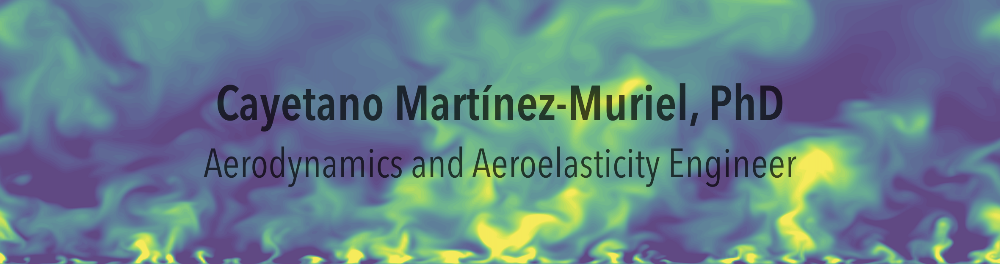

## Welcome to my personal dev-space!

Hi, I'm an Aerodynamics & Aeroelasticity Engineer and Researcher.

🛩️🍃💧💨 I focus on Computational Fluid Dynamics (RANS, DNS) and Nonlinear Structural Analysis ▲🏗️
⚙️ Specialized in developing parallel code for High-Performance Computing (HPC), scaling CFD-FEM coupled simulations
💻 I code daily in ```.py```, ```.m```, and sometimes dive into ```.f```, ```.f90```, ```.c```, ```.cpp```.
📂 Slowly filling this space with projects, solvers, and ideas — stay tuned!

<!--
**cayetanomarmur/cayetanomarmur** is a ✨ _special_ ✨ repository because its `README.md` (this file) appears on your GitHub profile.

Here are some ideas to get you started:

- 🔭 I’m currently working on ...
- 🌱 I’m currently learning ...
- 👯 I’m looking to collaborate on ...
- 🤔 I’m looking for help with ...
- 💬 Ask me about ...
- 📫 How to reach me: ...
- 😄 Pronouns: ...
- ⚡ Fun fact: ...
-->
