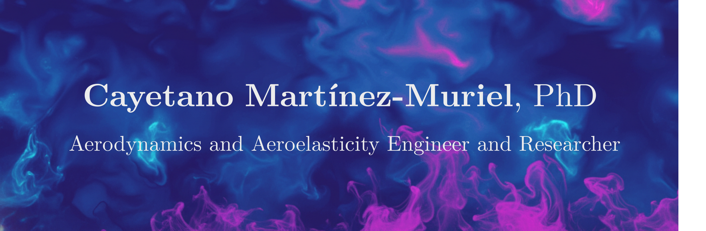

<!--

<h6>Background generated with Google gemini-2.5-flash-image.</h6>
-->

## $\large\color{#5871D0}\boldsymbol{\text{Hi there!}}$ 
### I'm Cayetano Martínez-Muriel, Engineer and Researcher 🛩️ 💻 
*I earned my PhD in Computational Aerodynamics, CFD & Aeroelasticity at the Univ. Carlos III Madrid.*

I bridge the gap between high-performance physical simulations and accessible digital tools. My work focuses on transforming complex mathematical models into functional, scalable software.
  
- Simulation Expertise: Specialized in CFD (RANS, DNS) and FEM-Nonlinear analysis. I develop parallel code for HPC and GPU-accelerated environments to push the boundaries of numerical simulation.

- High-Performance Dev: I optimize Python workflows using Numba and OpenCL. My core stack spans Python, Matlab, C++ and Fortran.

- Expanding Frontiers: Currently focusing on Data Science, Web Visualization, and AI. I build interactive applications to make massive datasets and complex physics accessible and understandable.

Currently turning my ideas—from aerodynamics to structural dynamics—into open-source projects for the engineering community. Have a look below and stay tuned. You can also follow me on [Linkedin](https://uk.linkedin.com/in/cmartinezmuriel)!
